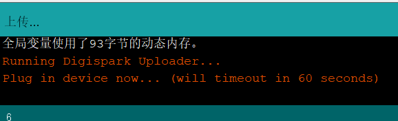

# IDE下载
https://www.arduino.cc/en/software
# 添加附加开发板管理器
IDE->文件->首选项:
http://digistump.com/package_digistump_index.json (https://raw.githubusercontent.com/digistump/arduino-boards-index/master/package_digistump_index.json) 

网墙限制下载不了可以把项目转存到https://gitee.com上

# 上传程序
 

编译后提示上传程序，此时插入板子到usb口
# 参考
- https://ericdraken.com/usb-mouse-jiggler/